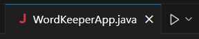
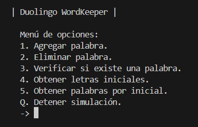
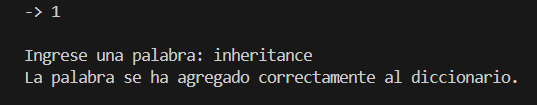
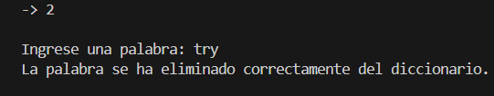
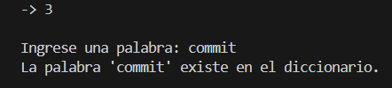
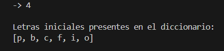
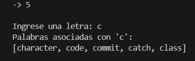
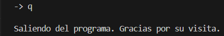

# Manual de Usuario - Duolingo WordKeeper
  
**_¡Bienvenido a Duolingo WordKeeper!_**

Esta aplicación te acompañará en tu proceso de adquisición de vocabulario en inglés de una manera sencilla y efectiva, proporcionándote un diccionario personal en el que almacenar, de manera organizada, todas las nuevas palabras que vayas aprendiendo, y permitiéndote acceder a ellas fácilmente. 

A continuación, te proporcionamos una guía básica para comenzar a utilizarla:

 

**- Ejecución del Programa:**
Ejecuta el programa para entrar en la aplicación.

 

**- Menú de Opciones:**
Una vez que el programa se haya iniciado, verás un menú de opciones en la consola. 
Selecciona una opción del menú utilizando las teclas numéricas o la letra 'Q'.

 

1. Agregar una Palabra: 
Selecciona la opción _Agregar palabra_ en el menú.
Ingresa la palabra que deseas añadir al diccionario cuando se te solicite.
La palabra será validada y agregada al diccionario si es válida. De lo contrario, se te pedirá que ingreses la palabra nuevamente.

2. Eliminar una Palabra: 
Selecciona la opción _Eliminar palabra_ en el menú.
Ingresa la palabra que deseas eliminar del diccionario cuando se te solicite.
La palabra será eliminada del diccionario si existe. De lo contrario, se te informará que la palabra no existe en el diccionario.

3. Verificar si una Palabra Existe: 
Selecciona la opción _Verificar si existe una palabra_ en el menú.
Ingresa la palabra que deseas verificar si existe en el diccionario cuando se te solicite.
La aplicación te informará si la palabra existe en el diccionario o no.

4. Obtener Letras Iniciales: 
Selecciona la opción _Obtener letras iniciales_ en el menú.
La aplicación te mostrará todas las letras iniciales presentes en el diccionario.

5. Obtener Palabras por Inicial: 
Selecciona la opción _Obtener palabras por inicial_ en el menú.
Ingresa la letra inicial de la cual deseas obtener las palabras asociadas.
La aplicación te mostrará todas las palabras que comienzan con la letra inicial ingresada.

6. Detener la Simulación: 
En cualquier momento, puedes seleccionar la opción _Detener simulación_ en el menú para salir de la aplicación.

 

¡Eso es todo! Ahora estás listo para comenzar a usar Duolingo WordKeeper y disfrutar aprendiendo y expandiendo tu vocabulario en inglés.

 

[<- Volver](../README.md)